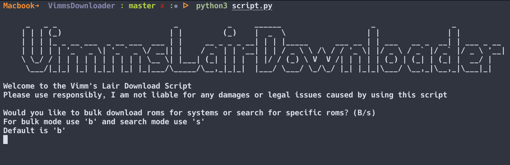
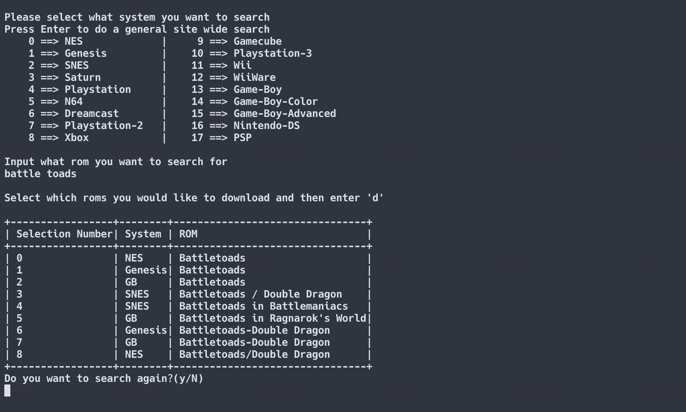

# Vimms-DL

Vimms-DL is a tool for downloading ROMs from the site [Vimm's Lair](https://vimm.net/)



## Installation

If you run it with VSCode and Docker Desktop, you can have your docker environment ready with everything installed to make the script work.

Otherwise, you'll need to setup a proper Python environment with the following constraints:
- Use `conda`, `virtualenv` or any other Pythjon virtual environment manager
- Python >= `3.9`

Then, run:

```bash
git clone https://github.com/lballore/vimms-downloader.git
cd vimms-downloader
pip install -r requirements.txt
python script.py
```

## Features
- Automatic extraction and deletion if specified for both modes

### Search Mode
- Search can be system specific or a general search across the whole site
- Example query below\
  

### Bulk Mode
- Can be used to download specified systems or all of them
- Creation of a console based alpha-numeric directory structure in the root project directory where the files are downloaded to

## Usage
- Follow the on screen instructions to go into either (Bulk/Search) mode
- From there it will prompt you on what criteria to search for or what systems you want to bulk download

## Contributing
Pull requests are welcome. For major changes, please open an issue first to discuss what you would like to change.

## License
[MIT](https://choosealicense.com/licenses/mit/)

## Credits
The script is a fork of [this project](https://github.com/TrendingTechnology/VimmsDownloader), by [Brian Tipton](https://github.com/BrianTipton1)
just adapted too the current [Vimm's Lair website](https://vimm.net/)
